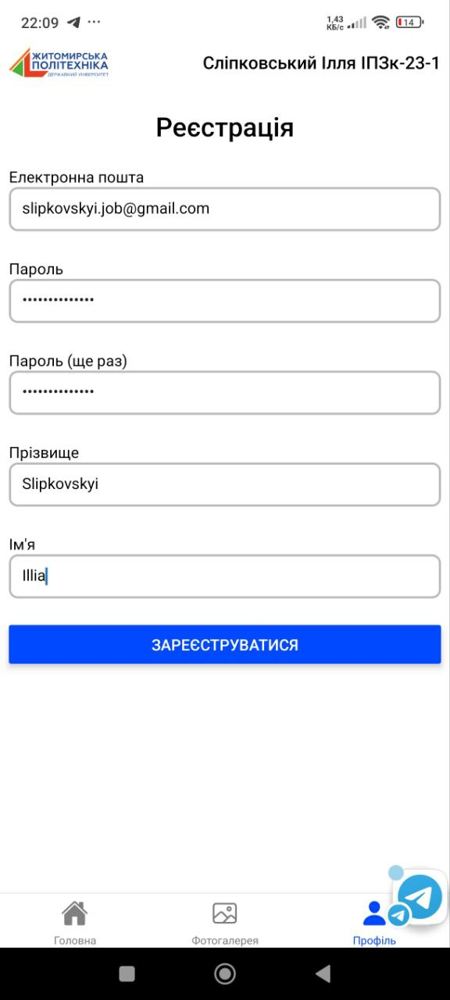
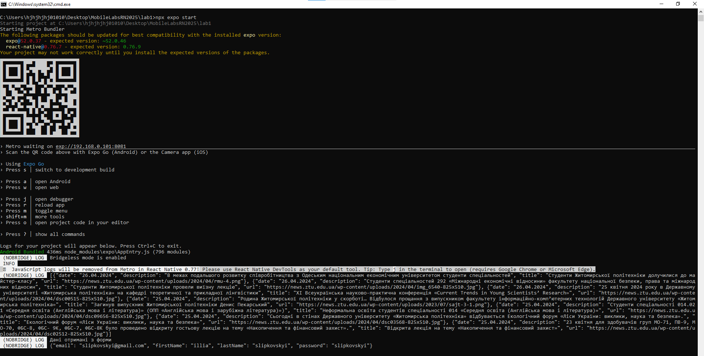

# Лабораторна робота №1 з дисципліни "Розробка мобільних застосунків"

## Виконав: студент групи ІПЗк-23-1 Сліпковський Ілля

* У застосунку реалізовано три основні екрани: Головна (містить новинну стрічку), Галерея та Профіль (з формою реєстрації користувача).
* Для перемикання між екранами використовується таб-перехід на базі бібліотеки **React Navigation**.
* Контент для новин і зображень завантажується з JSON-файлів, що розміщені у [репозиторії на GitHub](https://github.com/Slipkovskyi/MobileDataLab1RN2025), за допомогою **axios**.
* При натисканні на кнопку «Зареєструватися» введені дані відображаються в консолі у вигляді об'єкта.

### Інструкція з запуску застосунку:

1. Запустити команду `npx expo start`
2. Завантажити на смартфон додаток **Expo Go**
3. Відкрити Expo Go та просканувати QR-код, що з’явиться в терміналі

## Результат роботи додатку
### Головний екран з новинами

### Екран Фотогалерея

### Екран Профіль

### Дані отримані з форми

