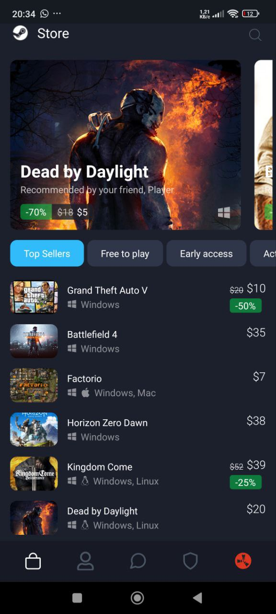
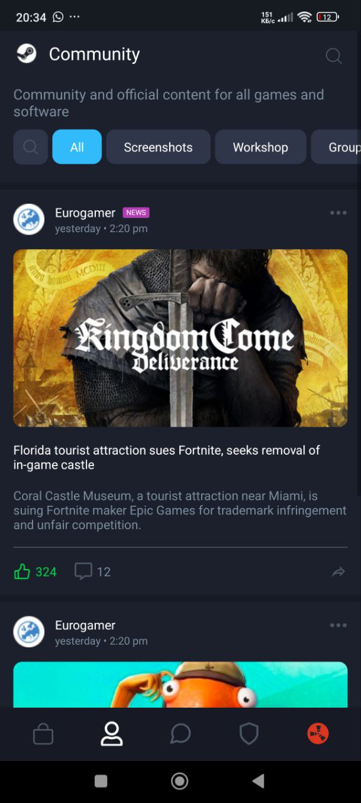
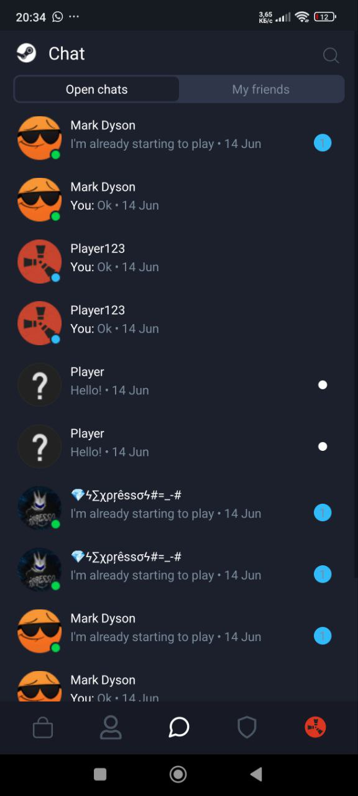
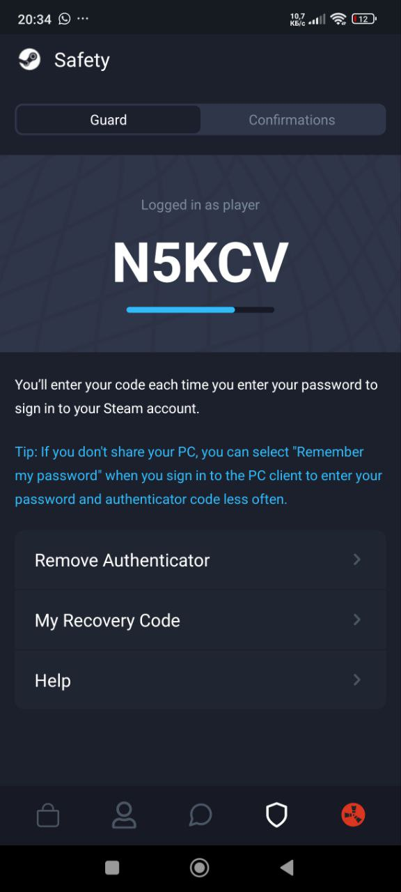
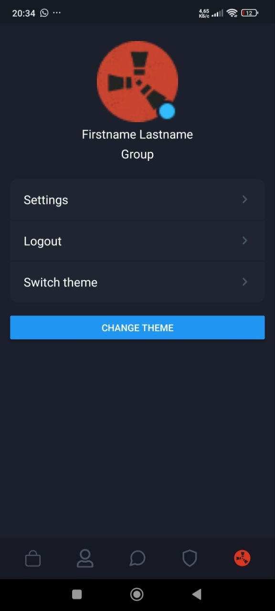
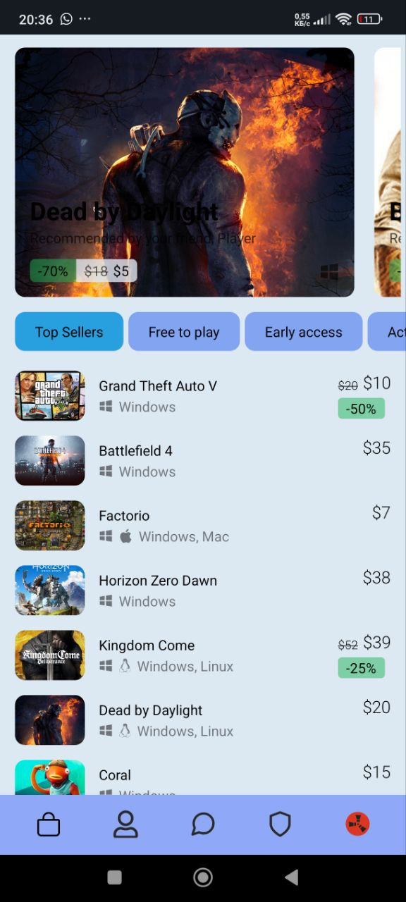

# Лабораторна робота №2 з дисципліни "Розробка мобільних застосунків"

## Виконав: студент групи ІПЗк-23-1 Сліпковський Ілля

**Тема:** Стилізація компонентів у React Native, списки, темізація

---

### Основні реалізації

- Використані **styled-components** для створення компонентів із підтримкою темізації (світла/темна тема) за допомогою `ThemeProvider`.
- Навігація між екранами реалізована через **React Navigation**.
- Для відображення списків (Store, Community, Chat) застосовано **FlatList** з механізмом **infinite scroll**.
- Збережено модульність: повторні елементи (GameCard, NewsItem, ChatItem тощо) винесені у папку `components/`.
- UI відтворений у стилі Steam згідно макетів у Figma:  
  https://www.figma.com/design/MqvgyshAGqymGnxhsutXGE/App-Concept?node-id=0-1&t=qOOOHpmK9B8c2ZHQ-1
- Реалізовано п’ять екранів: Store, Community, Chat, Safety, Профіль користувача.

---

### Інструкція з запуску

1. **Клонувати репозиторій**  
   ```bash
   git clone https://github.com/Slipkovskyi/MobileLabsRN2025.git
   cd MobileLabsRN2025
   cd lab2
   ```
2. **Встановити залежності**  
   ```bash
   npm install
   ```
3. **Запустити додаток**  
   ```bash
   expo start
   ```
4. **Відкриття на пристрої**  
   - Скачайте **Expo Go** на смартфон.  
   - Скануйте QR-код, що з’явиться в терміналі.

---

### Скриншоти роботи додатку

#### Store  


#### Community  


#### Chat  


#### Safety  


#### Profile  


### White theme
