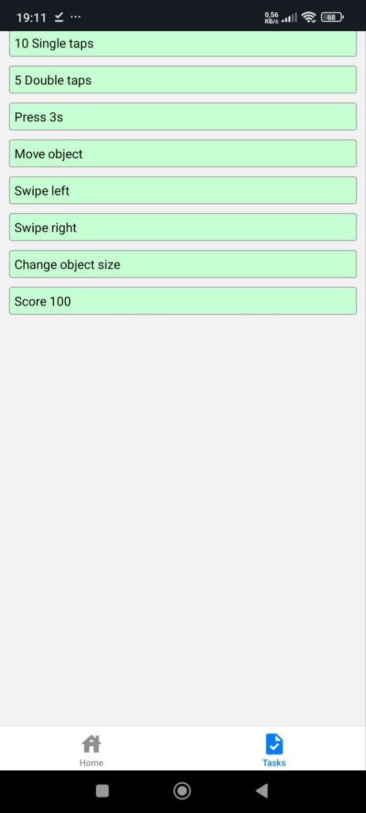

# Лабораторна робота №3 з дисципліни "Розробка мобільних застосунків"

## Виконав: студент групи ІПЗк-23-1 Сліпковський Ілля

**Тема:** Використання жестів у React Native за допомогою `react-native-gesture-handler`

---

### Основні реалізації

- На головному екрані реалізовано гру-клікер з лічильником очок.
- Використані різні Gesture Handlers із бібліотеки **react-native-gesture-handler**:
  - `TapGestureHandler` — одиночне натискання для +1 очка і подвійний тап для подвоєння очок.  
  - `LongPressGestureHandler` — утримання натискання для бонусних очок.  
  - `PanGestureHandler` — перетягування об’єкта по екрану.  
  - `FlingGestureHandler` — свайп вліво/вправо для випадкових бонусів.  
  - `PinchGestureHandler` — масштабування об’єкта для додаткових бонусів.

- Екран "Завдання" із переліком 10 завдань, реалізований через **FlatList** з відображенням статусу виконання.

- Навігація між екранами (Головна ↔ Завдання) побудована з використанням **@react-navigation/native**.

- Модульність: повторні UI-елементи (TaskItem, GameButton тощо) винесені у папку `components/`.

---

### Інструкція з запуску

1. **Клонувати репозиторій**  
   ```bash
   git clone https://github.com/Slipkovskyi/MobileLabsRN2025.git
   cd MobileLabsRN2025/lab3
   ```

2. **Встановити залежності**  
   ```bash
   npm install
   ```

3. **Запустити сервер**  
   ```bash
   expo start
   ```

4. **Відкрити програму на пристрої**  
   - Встановіть **Expo Go** на смартфон.  
   - Скануйте QR-код, що з’явиться в терміналі.

---

### Скриншоти роботи додатку




